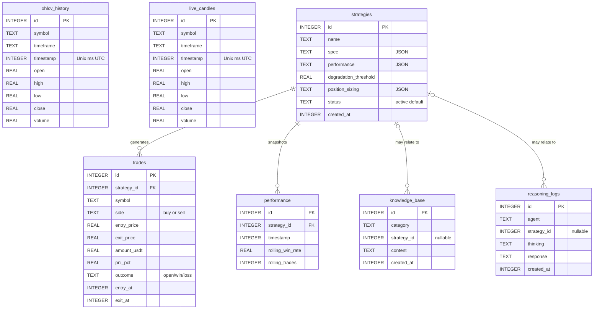
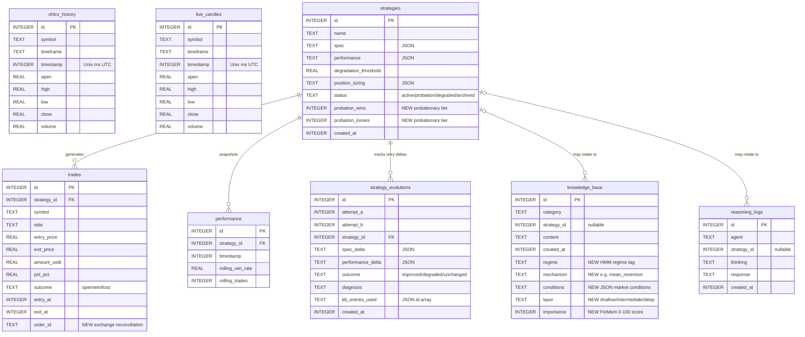

# Database schema — original vs current

Two ER diagrams showing how the SQLite schema in `src/data/schema.py` has evolved from the original Module 1 spec (early April 2026) to the current state (June 2026). Primary keys are marked `PK`, foreign keys `FK`. Connections shown with crow's-foot cardinality (one-to-many).

---

## Original schema (≈ 2026-04-09, Module 1 spec)

Seven tables. Two FKs, both pointing to `strategies.id`.

**Notes**:
- `ohlcv_history` and `live_candles` are isolated — no FKs into anything else (intentional: candles are pair/timeframe-keyed, not strategy-keyed).
- `knowledge_base.strategy_id` and `reasoning_logs.strategy_id` are nullable (some KB entries are project-wide, not strategy-specific).

---

## Current schema (2026-06-07)

Three structural additions plus one new table. New columns highlighted in the diagram with their introducing decision.

---

## Summary of changes

| Table | Change | Driving decision |
|---|---|---|
| `strategies` | + `probation_wins`, `probation_losses` (NOT NULL DEFAULT 0) | [[2026-04-20-probationary-tier]] |
| `strategies.status` | Now accepts `probation` in addition to `active/degraded/archived`; column became NOT NULL | [[2026-04-20-probationary-tier]] |
| `trades` | + `order_id` TEXT for Binance order reconciliation | [[2026-04-10-module4-init-db-once]] / Module 4 build |
| `knowledge_base` | + `regime`, `mechanism`, `conditions` (regime-aware KB) | [[2026-04-15-hmm-regime-detection]] |
| `knowledge_base` | + `layer` (`shallow/intermediate/deep`), `importance` (0–100) | [[2026-04-15-finmem-layered-memory]] |
| **NEW** `strategy_evolutions` | Tracks Loop 1 retry deltas (spec change → performance change) for the strategy-evolution RL layer | Phase 4 strategy evolution tracking |
| Indexes | Added on `(symbol, timeframe, timestamp)`, `category`, `created_at DESC`, `regime`, `layer`, `strategy_id` on trades + logs | Performance — not a schema change |

All additions are backward compatible. The `_migrate_*_columns` helpers in `schema.py` use `PRAGMA table_info` to add missing columns at startup, so existing databases upgrade automatically without a migration script.

## Related

- MOC: [[_architecture]]
- Module: [[data_pipeline]]
- Key decisions: [[2026-04-15-hmm-regime-detection]] · [[2026-04-15-finmem-layered-memory]] · [[2026-04-20-probationary-tier]]
